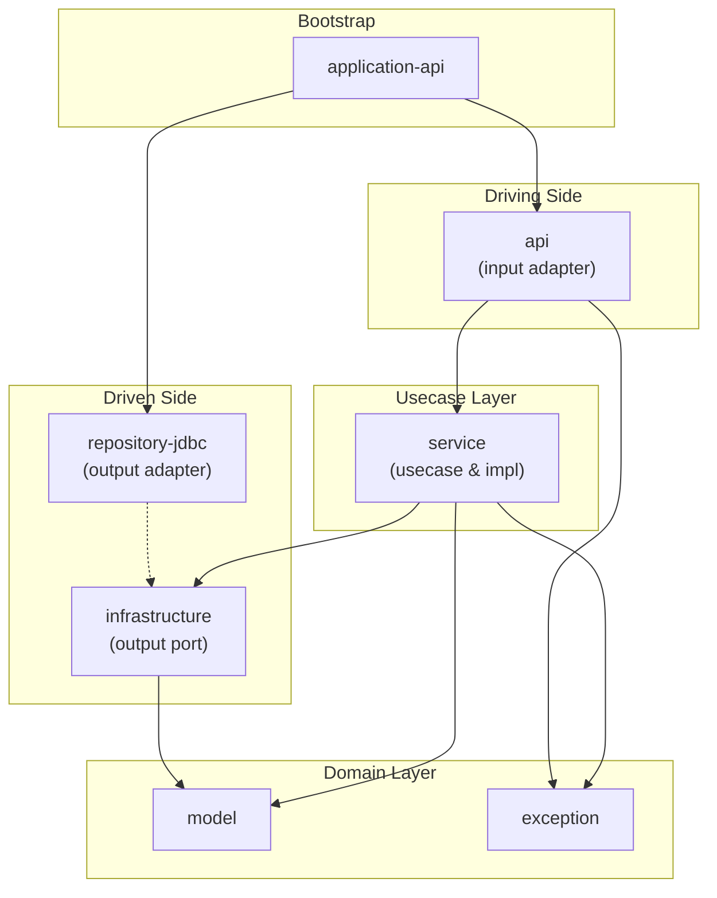

# 모듈

## 의존성 그래프

## 설명

hexagonal architecture (Ports and Adapters Architecture)를 기반으로 한 그래들 멀티 모듈 구조로 구성함.

### Model Module (`model`)

- 도메인의 핵심이 되는 모델들을 포함
- 도메인 모델들이 가져야 하는 핵심 비즈니스 로직을 포함할 수 있음
- 비즈니스 로직이 포함될 경우 단위 테스트 수준의 테스트 코드가 권장됨

### Service Module (`service`)

- 비즈니스 로직 구현을 포함
- persistence / network가 필요한 모듈과 직접 참조를 하지 않음
- 비즈니스 로직을 검증하기 위한 테스트 코드를 반드시 포함하도록 함
  - 테스트 방법에 따라 테스트 코드들은 persistence 테스트 도구를 활용 가능 
- 외부 모듈에 노출할 Use Case와 모듈 내부에서만 사용 가능한 코드를 엄밀히 구분할 수 있도록 하여야 함

### Exception Module (`exception`)

- `service`(혹은 `model`)의 비즈니스 로직에서 발생할 수 있는 예외들을 정의함

## Driving(Primary) Side

### API Module (`api`)

- web / mobile 환경에서 사용자의 REST API 요청을 처리하기 위한 컨트롤러들을 포함
- 컨트롤러 수준의 request / response 검증 테스트를 추천함

## Driven(Secondary) Side

### Infrastructure Module (`infrastructure`)

- persistence / network 레이어 사용을 위한 규격을 포함
- 직접 구현을 포함하지 않음
  - `service` 모듈에서의 테스트 용이성을 고려

### Repository Module (`repository-{type}`)

- `infrastructure`에 정의된 persistence 규격을 구현함
- RDB / NoSQL 등에 따라 적절한 type을 사용 (rdb? / jpa? / jdbc? / document?)

## Application Modules

- Hexagonal Architecture에서 사용되고 있는 `application` 용어와 혼란이 있을 수 있음
- 여기에서는 제공하는 기능에 따른 모듈 의존 관계와 서버 실행을 위한 환경 설정을 포함하는 모듈을 의미함

### Application Module (`application-{type}`)

- `application-api`, `application-cron`과 같이 해당 어플리케이션 특성에 맞게 의존 관계 및 서버 실행을 위한 환경 설정을 포함함.
